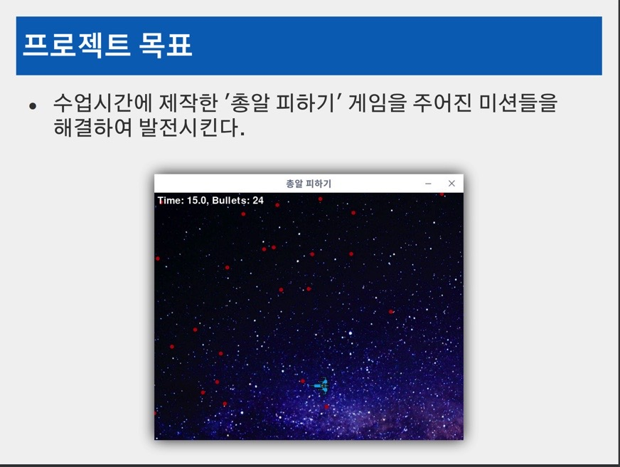

# python을 이용한 총알 피하기 게임 만들기

---

## Project goal



---

## Project content

- 미션1. 비행기가 총알에 맞았을 때 효과음이 발생하도록 한다.
- 미션2. 비행기가 총알에 맞았을 때 터지는 그림 효과가 나타나도록 한다.
- 미션3. 배경그림이 비행기의 움직임에 반응하여 같이 움직이도록 한다.
- 미션4. 비행기가 총알과 여러번 충돌해야 게임이 종료되도록 한다.  
  – 즉, '생명력' 개념을 도입한다.  
  – 참고: 총알에 맞으면 일정시간동안 무적이 되어야 정상적으로 작동한다.
- 미션5. 무적시간동안 비행기가 반짝거리도록 한다.
- 미션6. 남은 생명력을 막대기(5점)와 숫자(5점)로 표시한다.
- 미션7. 총알을 여러 종류로 만들고, 종류별로 크기와 색깔을 다르게 표현한다.
- 미션8. 총알의 종류마다 플레이어와 충돌했을 때 차감되는 생명력을 다르게 한다.
- 미션9. 사용자의 가장 오래 버틴 생존 시간을 최대 10개까지 파일에 기록한다.
- 미션10. 게임오버시에 기록된 생존시간을 화면에 출력한다.
- 미션11. 게임오버시에 기록된 생존시간을 화면에 출력하며, 현재 기록이 순위권에 있을 경우 강조하여 표시한다.

---

## How to run game

해당 파일들을 다운 받은 후 main.py를 실행한다.  
**만약 pygame이 설치돠어 있지 않다면**

```
$ pip3 install pygame or pip install pygame
```

---

### For Detailed description of the game, please refer to the pdf file.
